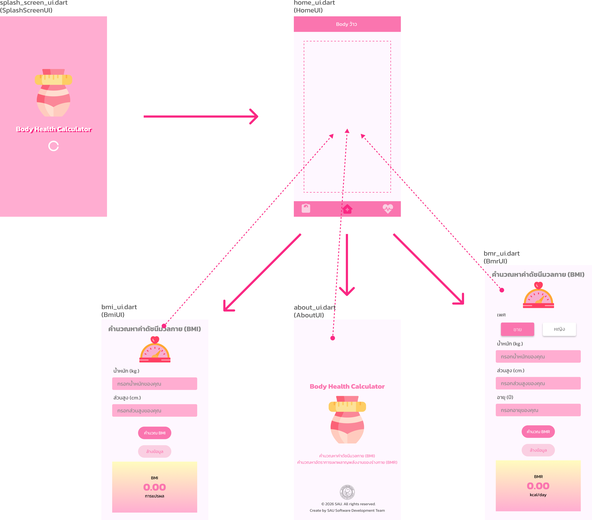
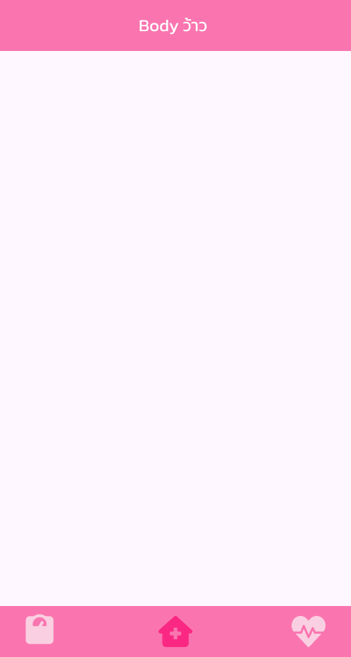
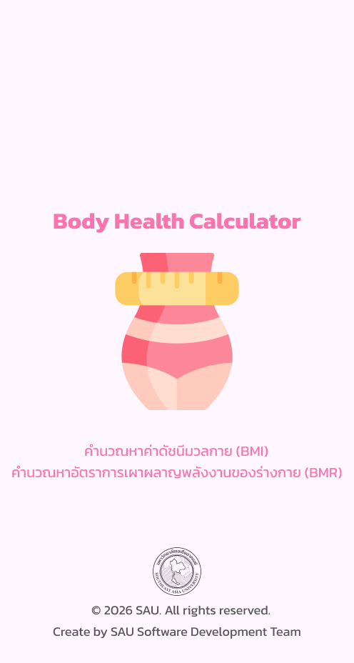
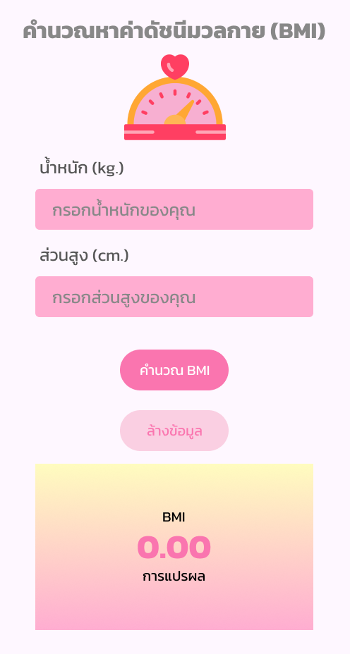
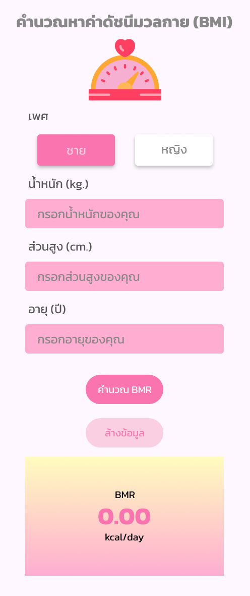

# flutter body health calculator project

โปรเจค **flutter body health calculator project** เป็นโปรเจคสำหรับรายวิชา **Mobile Development** จัดทำขึ้นเพื่อฝึกการพัฒนา Mobile Application ด้วย **Flutter และ Dart**

ในส่วนที่รับผิดชอบปัจจุบันเป็นการพัฒนา **User Interface (UI)** ของแต่ละหน้าภายในแอป ได้แก่ **Splash Screen, Home, About, BMI และ BMR** โดยเน้นการออกแบบหน้าจอและ Navigation ระหว่างหน้า โดยยังไม่ได้เชื่อมต่อกับ **Backend หรือ API**

## 📱 UI Flow



## 🧩 Details UI:

- SplashScreenUI — หน้าจอเริ่มต้นของแอป แสดงเป็นเวลา 3 วินาที จากนั้นจะไปยัง HomeUI
- HomeUI — หน้าหลักของแอป มี BottomNavigationBar สำหรับนำทางไปยังหน้า About, BMI และ BMR
- AboutUI — หน้าแสดงข้อมูลเกี่ยวกับแอป
- BmiUI — หน้าสำหรับคำนวณดัชนีมวลกาย (BMI)
- BmrUI — หน้าสำหรับคำนวณอัตราการเผาผลาญพลังงานพื้นฐาน (BMR)

## 🎨 Pages / UI ที่พัฒนา

| SplashScreenUI |      HomeUI      |      AboutUI      |       BmiUI       |       BmrUI       |
|---|---|---|---|---|
|  |  |  |  |  |


## 🛠️ Technologies

- **Flutter**
- **Dart**
- Material Design

## 📂 UI Files

```text
lib/
├── views/
    ├── splash_screen_ui.dart
    ├── home_ui.dart
    ├── about_ui.dart
    ├── bmi_ui.dart
    └── bmr_ui.dart
```

> ตำแหน่งไฟล์อาจแตกต่างกันตามโครงสร้างจริงของโปรเจค เช่น `lib/screens/`, `lib/pages/` หรือ `lib/ui/`

## 🎯 Project Objectives

โปรเจคนี้จัดทำขึ้นเพื่อ:

- เรียนรู้การพัฒนา Mobile Application ด้วย Flutter และ Dart
- ฝึกพัฒนาและออกแบบ User Interface (UI) สำหรับ Mobile Application
- ฝึกสร้าง Navigation และ BottomNavigationBar สำหรับการเปลี่ยนหน้าภายในแอป
- ฝึกออกแบบ UI Flow และโครงสร้างการใช้งานของแอป
- พัฒนา UI สำหรับการคำนวณ BMI และ BMR
- ฝึกจัดโครงสร้างและแยกไฟล์ UI ของแต่ละหน้าภายในโปรเจค
- ฝึกการทำงานร่วมกันและแบ่งส่วนงานภายในโปรเจค

## 👩‍💻 My Contribution

ส่วนที่รับผิดชอบในโปรเจคในปัจจุบัน:

- Splash Screen UI
- Home UI
- About UI
- Bmi UI
- Bmr UI

**Scope ของงานปัจจุบัน:** เน้นการพัฒนา **Frontend / UI และ Navigation** เท่านั้น โดยยังไม่มีการเชื่อมต่อ Authentication, Backend หรือ API

## 📚 Course

**Course:** Mobile Development  
**Project:** flutter body health calculator project
